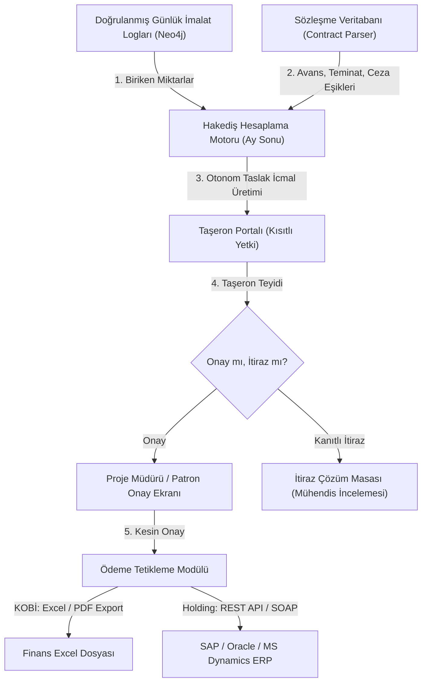
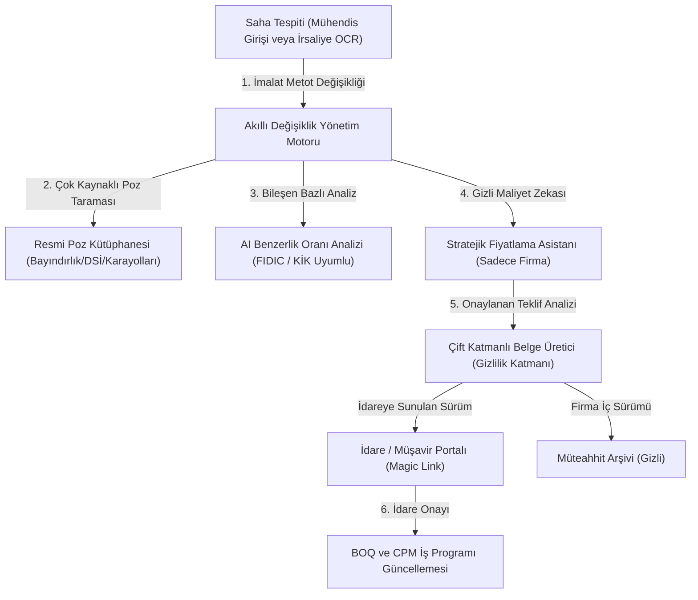
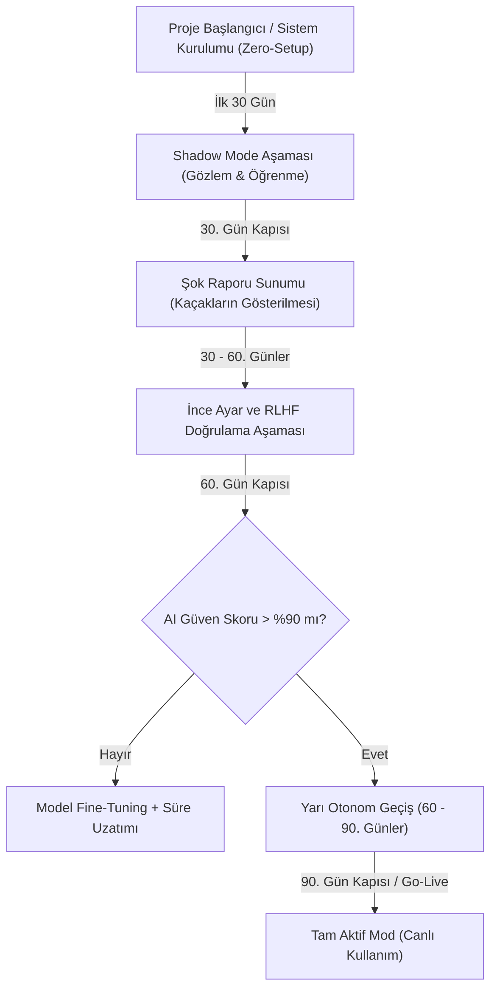

# 17. WORKFLOWS (İş Akışları ve Shadow Mode Protokolü)

Bu belge, Global Construction Intelligence Platform'un (GCIP) veri girişinden finansal ödemeye ve yasal hak taleplerine kadar şantiyeyi yöneten **İş Akışlarını** ve yapay zekanın güvenli bir şekilde sahaya entegre olmasını sağlayan **Shadow Mode (Faz 0) Canlıya Geçiş Protokolünü** tanımlar. Akışlar, KOBİ'lerin bağımsız (standalone) çalışma gerçekleri ile Holdinglerin kurumsal (P6/SAP/Oracle) entegrasyon seviyelerini uçtan uca birbirine bağlar.

---

## 17.1. Akış 1: Saha İlerleme Giriş ve Çift Doğrulama Akışı
Sahadan gelen verilerin manipülasyonunu engellemek amacıyla alt kaynak (formen/ses) ve üst kaynak (mühendis/günlük defter) bağımsız kanallardan gelen verilerle çapraz kontrol edilir.

### 17.1.1. Veri Akış Diyagramı (Mermaid)
```mermaid
graph TD
    A["Formen / Saha Çalışanı (Ses/WhatsApp/PWA)"] -->|1. Günlük İlerleme Beyanı| B["Orkestratör & Whisper NLP Parser"]
    B -->|2. Yapısal Normalleştirme| C["Geçici Doğrulama Havuzu (Staging DB)"]
    D["Saha Mühendisi (PWA / Tablet)"] -->|3. Dijital Günlük Defter Onayı| E["Resmi Kayıt Katmanı"]
    C --> F["Çapraz Kontrol Motoru (Cross-Check Engine)"]
    E --> F
    F -->|4. Eşleşme (Tolerans < %15)| G["Neo4j Grafik DB Onaylı İlerleme"]
    F -->|5. Çelişki (Fark > %15)| H["L3 Alarmı Tetikleme (Notification Strategy)"]
    H -->|6. Proje Müdürü / Şef İncelemesi| I{"Manuel Karar"}
    I -->|Mühendis Verisi Doğru| G
    I -->|Formen Verisi Doğru| J["İmalat Kaydı Düzeltme + Onay"]
```

### 17.1.2. Akış Adımları ve İş Kuralları
1.  **Günlük Saha Beyanı (Formen):** Formen şantiye kapanış saatinde (Örn: 17:00) WhatsApp ses kaydı veya PWA üzerinden o gün yaptığı imalatı bildirir (Örn: *"A Blok zemin kat 2. Kısım demir donatı tamamlandı"*).
2.  **Mühendis Defteri (Üst Kaynak):** Saha mühendisi, şantiyeyi denetledikten sonra PWA üzerinden Dijital Şantiye Günlük Defterini doldurur ve zaman damgasıyla imzalar.
3.  **Çapraz Kontrol Algoritması:** Sistem, iki veriyi Neo4j Graph DB üzerinde eşleştirir. Metrajlar ve konumlar arasındaki fark incelenir:
    *   **Tolerans Dahilinde (Fark <= %15):** Sistem otomatik onay verir. Veri, hakediş biriktirme tablosuna yazılır.
    *   **Tolerans Dışında (Fark > %15 veya Konum Uyuşmazlığı):** Sistem [L3 - Yüksek] alarm seviyesini tetikler. Çelişki çözülene kadar o imalat kalemi askıya alınır.
4.  **Çelişki Çözümü (Conflict Resolution):** Proje müdürü uyuşmazlık ekranında her iki tarafın beyanını ve sahadaki QR Noktası fotoğraflarını görür. Doğru veriyi seçerek onaylar, sistem bu kararı RLHF (İnsan Onay Döngüsü) modeline geri bildirim olarak iletir.

---

## 17.2. Akış 2: Otonom Taşeron Hakediş Onay ve Muhasebe Entegrasyon Akışı
Hakediş icmallerinin manuel Excel hesaplamalarında kaybolmasını, avans ve teminat kesintilerinin unutulmasını engelleyen finansal akıştır.

### 17.2.1. Veri Akış Diyagramı (Mermaid)


### 17.2.2. Akış Adımları ve İş Kuralları
1.  **Hakediş Kesinti Hesaplaması:** Ayın 25'inde sistem, o döneme ait doğrulanmış imalat miktarlarını sözleşme birim fiyatlarıyla çarpar. Eş zamanlı olarak:
    *   Sözleşmedeki avans oranı üzerinden **Avans Mahsubunu** keser.
    *   Sözleşmedeki teminat oranı üzerinden **Güvence Kesintisini (Retention)** tutar.
    *   İSG ve QA/QC (nefaset) ajanlarından gelen **Kanıtlı Cezaları** düşer.
2.  **Taşeron İnceleme Süreci:** Taşeron, portalda hakediş icmalini inceler. Kesilen İSG cezalarının yanındaki "Kanıta Git" butonuna basarak işçisinin baretsiz çekilmiş zaman damgalı fotoğrafını görebilir.
3.  **İtiraz Yönetimi:** Taşeron itiraz ederse gerekçe girerek kanıt sunmak zorundadır (Örn: Ekstra metraj ölçüm belgesi). İtiraz edilen kalem dondurulur, kalan net tutar ödeme onayına gönderilir.
4.  **Muhasebe/ERP Aktarımı:** Kesin onay sonrası:
    *   **KOBİ Modu:** Patron tek tıkla hakedişi banka ödeme formatında Excel olarak indirir.
    *   **Kurumsal Mod:** SAP (S/4HANA REST API) veya Oracle Fusion web servislerine otomatik hakediş muhasebe fişi (FI/CO) ve satınalma onay kaydı (PO Release) gönderilir.

### 17.2.3. Müşavir / İşveren Eşzamanlı Saha Denetim Akışı (Joint Measurement)
Hakedişin idari olarak kesinleşmesinden önce yürütülen resmi denetim akışıdır:
*   **Denetim Tetiklenmesi:** Her ayın 22'sinde sistem, o döneme kadar doğrulanmış imalatların listesini içeren bir **"Ön-Hakediş Denetim Haritası"** çıkarır ve Müşavir ile Müteahhit saha şefine Magic Link üzerinden gönderir.
*   **Yerinde Doğrulama:** İkai taraf sahayı gezerken, PWA üzerindeki QR kodlarını okutarak ilgili bölgedeki imalatı görsel olarak doğrular.
*   **Red ve Öteleme Mekanizması:** Müşavir bir bölgedeki imalatı kusurlu bularak reddederse (Örn: Alçı sıva yüzey düzgünlüğü uyuşmuyor), sistem o bölgenin metrajını otonom olarak bu ayın hakedişinden düşer. Düşülen metraj silinmez, "Kusur Düzeltme Modu"nda bir sonraki ayın staging havuzuna otonom aktarılır.

---

## 17.3. Akış 3: Akıllı Değişiklik Yönetimi (Metot / Birim Fiyat) Akışı
Sahadaki imalat değişikliklerinin (Metot A'dan Metot B'ye geçiş) sözleşmesel ve finansal etkilerini (Mukayeseli Keşif) otonom yöneten akıştır.

### 17.3.1. Veri Akış Diyagramı (Mermaid)


### 17.3.2. Akış Adımları ve İş Kuralları
1.  **Değişiklik Tespiti:** Sistem sahadaki metot veya malzeme değişimini algılar (Örn: Projede yerinde döküm beton olan imalatın sahada prekasta dönüştürülmesi).
2.  **Benzer Poz Bulma ve Analiz:** Sistem, resmi devlet poz kitaplarını (Çevre ve Şehircilik Bakanlığı, DSİ vb.) tarayarak en yakın benzer pozları bulur. Malzeme, işçilik ve ekipman kırılımlarını analiz ederek **Savunulabilir Benzerlik Oranını** hesaplar.
3.  **Stratejik Fiyatlama:** Şirket sahibine özel ekranda piyasa zekası verilerini sunarak *"İdarenin kabul bandı 2.400 - 2.900 TL'dir. 2.650 TL teklif etmeniz durumunda kabul şansı yüksek ve kâr marjınız %15 olacaktır"* önerisinde bulunur.
4.  **Çift Katmanlı Belge Üretimi:** Sistem iki nüsha oluşturur. İdareye gönderilecek PDF'te şirketin iç maliyetleri ve kâr marjları otonom olarak gizlenir (Privacy Filter).
5.  **Teyit ve Entegrasyon:** İdare veya müşavir Magic Link üzerinden teklifi onayladığı an, sistem yeni birim fiyatı Keşif Özetine (BOQ) işler, yerel CPM iş programındaki süreleri revize eder ve iptal olan malzemelerin tedarik siparişlerini otomatik durdurur (Cascade Effect).

---

## 17.4. Akış 4: Süre Uzatımı (EOT) ve Claim Yönetim Akışı
Projelerde idareden veya dış etkenlerden kaynaklı gecikmelerin yasal hak düşürücü süreler (Claim Bar-Dates) içinde resmiyete kavuşturulması akışıdır.

### 17.4.1. Veri Akış Diyagramı (Mermaid)
```mermaid
graph TD
    A["Gecikme Olayı Tetiklenmesi (Hava/İdare/İmar Gecikmesi)"] -->|1. Olay Tespiti| B["Sözleşme Ajanı (Contract Parser)"]
    B -->|2. Yasal Süre Başlatma| C["Bar-Date Geri Sayım Motoru"]
    B -->|3. Kritik Yol Etki Analizi| D["Yerel CPM İş Programı Motoru"]
    C -->|4. Son 7 Gün / Uyarı Seviyesi L3| E["Saha / Proje Müdürü Bildirimi"]
    C -->|5. Son 24 Saat / Uyarı Seviyesi L4| F["Patron / CEO Bildirimi (Acil Taslak)"]
    F -->|6. Mühendis/Yönetici Onayı| G["Zaman Damgalı E-Posta Gönderimi"]
    G -->|7. Hukuki Arşivleme (RFC 3161)| H["Bilirkişi Kanıt Klasörü"]
```

### 17.4.2. Akış Adımları ve İş Kuralları
1.  **Gecikme Tespiti:** Sistem meteoroloji API'sinden gelen aşırı hava muhalefeti verisini veya idareden gelen geç teslim onayını algılar.
2.  **Yasal Geri Sayım (Claim Sayaçları):** FIDIC veya kamu sözleşmelerindeki hak düşürücü süre (Örn: FIDIC 20.1 uyarınca 28 gün, kamu projelerinde 14 gün) için otonom sayaç çalışmaya başlar.
3.  **Kritik Yol Analizi:** native CPM motoru, gecikmenin projenin son teslim tarihine (Critical Path) olan net etkisini gün bazlı hesaplar (Süre Uzatımı ihtiyacı).
4.  **Otonom Claim Mektubu Hazırlama:** Sistem; meteoroloji raporlarını, çizim revizyon loglarını ve etkilenen CPM Gantt şemasını ekleyerek yasal süre uzatımı taslağını otonom yazar.
5.  **Zaman Damgalı İletim:** Proje müdürü onayladığı an claim yazısı resmi kanallardan iletilir ve hukuken delil teşkil etmesi için RFC 3161 kriptografik zaman damgasıyla sisteme kilitlenir.

---

## 17.5. Akış 5: Shadow Mode (Faz 0) ve Canlı Kullanıma Geçiş Protokolü
Teknolojinin şantiye çalışanları tarafından reddedilmesini önlemek ve yapay zekanın veri doğruluğunu garanti altına almak için uygulanan 90 günlük pilot süreçtir.

### 17.5.1. Veri Akış Diyagramı (Mermaid)


### 17.5.2. Geçiş Eşikleri ve Kriterleri (Gates)

#### 1. Giriş Eşiği (0. Gün):
*   *Kriter:* Şantiyenin kümülatif BOQ (Keşif) listesinin yüklenmesi, yetki matrisinin tanımlanması.
*   *Çalışma Modu:* Tamamen pasif. Yapay zeka veri tabanını doldurur ama hiçbir ekrana alarm veya öneri göndermez.

#### 2. Şok Raporu Eşiği (30. Gün):
*   *Kriter:* Sistem, şantiye şeflerinin ve taşeronların manuel WhatsApp/Excel hareketlerini izleyerek o ay kaçırılan finansal sızıntıları (Örn: Unutulan avans mahsupları, eksik irsaliyeler) raporlar.
*   *Amaç:* Patronun sisteme olan inancını (ROI) somut veriyle kanıtlamak.

#### 3. Güvenirlik ve RLHF Eşiği (60. Gün):
*   *Kriter:* Yapay zekanın hazırladığı hakediş icmalleri ile mühendislerin manuel hazırladığı icmaller karşılaştırılır. Modelin doğruluk ve güven puanı (Confidence Score) ölçülür.
*   *Geçiş Kriteri:* AI doğruluğu son 30 günde ardışık olarak **> %90** ise sistem bir sonraki faza geçer. Altındaysa model yerel proje verileriyle yeniden eğitilir (fine-tuning).

#### 4. Canlı Kullanım (Go-Live) Eşiği (90. Gün):
*   *Kriter:* Sistem artık pasif gözlemci değildir. Yarı otonom bildirimler ve onay akışları üretmeye başlar. Sorumluluk onay butonuyla her zaman insanda tutulur.

---

## 17.6. Olağanüstü Akış: Taşeron Fesih ve Kesin Hesap Tasfiye Akışı
Şantiyede taşeronun iflası, işi bırakması veya tek taraflı fesih durumlarında sistemin finansal ve operasyonel güvenliği koruma akışıdır:
1.  **Dondurma ve Kilitleme:** Fesih kararı tetiklendiği an sistem, ilgili taşerona ait tüm aktif saha günlük kayıtlarını, irsaliye onaylarını ve hakediş birikimlerini otonom olarak dondurur.
2.  **Fesih Kesin Hesap Bilançosu (Termination Balance):** Sistem, o güne kadar doğrulanmış imalat miktarlarını, ambar stoğundaki taşeron malzemelerini, kesilmiş cezaları ve içeride tutulan teminat (retention) mektubu sürelerini tarayarak anında yasal bir **"Fesih Kesin Hesap Raporu"** hazırlar.
3.  **Kritik Yol Etkisi:** Tasfiye nedeniyle boşta kalan WBS aktivitelerinin projenin teslim tarihine olan gecikme etkisi native CPM motoruyla hesaplanır.
4.  **Alternatif Taşeron Önerisi:** Sistem, holdingin/firmanın geçmiş projelerdeki taşeron performans veri bankasından (Data Network Effect), yarım kalan iş kalemlerini en hızlı ve en düşük zayiatla tamamlayabilecek en yüksek puanlı 3 alternatif taşeronu otonom olarak önerir.

## 17.7. Yapı Denetim Donatı Kontrolü ve Beton Döküm Vize Akışı

Bu akış, şantiyedeki kritik imalatların (donatı/kalıp) resmi onay süreçlerini ve beton dökümü sonrası RFID/Olgunluk takibini otonom yönetir.

### 17.7.1. Veri Akış Diyagramı (Mermaid)
```mermaid
graph TD
    A["Kalıp & Donatı İmalatının Tamamlanması"] -->|1. Kontrol Talebi| B["Orkestratör & Aplikasyon Kontrolü"]
    B -->|2. Sınır Tecavüz Analizi| C{"Sapma > 5mm mi?"}
    C -->|Evet 🔴| D["L4 Bloke & Yapı Denetim Uyarısı"]
    C -->|Hayır 🟢| E["Görsel AI Rebar Kontrolü"]
    E -->|3. Hata Tespiti| F{"Proje Uyumu Tam mı?"}
    F -->|Hayır 🔴| G["Düzeltme Talebi (Taşeron Uyarısı)"]
    F -->|Evet 🟢| H["Yapı Denetim Magic Link Onay Sistemi"]
    H -->|4. Denetçi Onayı / YDS Vize| I["Beton Döküm İzni (WBS Kilit Açma)"]
    I -->|5. Mikser Çıkış & RFID Eşleme| J["Beton Dökümü ve IoT Kür Takibi"]
    J -->|6. Olgunluk Doğrulaması (ASTM C1074)| K["7/28 Günlük Laboratuvar Kırım Analizi"]
```

### 17.7.2. Akış Adımları ve İş Kuralları
1.  **Aplikasyon ve Sınır Kontrolü:** Kaba yapı taşeronu kalıp ve donatı işini bitirdiğinde sistem otonom sınır tecavüz (Boundary Collision) analizini tetikler. Komşu parsele taşma ($E_{\text{boundary}} > 5$ mm) saptanırsa, sistem `WBSActivity` döküm iznini bloke eder ve denetçiyi L4 seviyesinde uyarır.
2.  **Görsel AI Donatı Kontrolü:** Harita kontrolü yeşil alan ise, denetçi mühendis saha kontrolünde PWA ile donatının fotoğrafını çekip sisteme yükler. `SAF-7` (Quality) ajanı demir adet ve etriye aralıklarının statik çizim projeyle uyumunu sorgular. Hata yoksa Yapı Denetçisine dijital onay talebi iletir.
3.  **YDS Donatı Vizesi (Onay):** Yapı Denetçisi Magic Link ile gelen fotoğraflı donatı kontrol vizesini dijital olarak onaylar. Onay kaydı e-imzalanarak YDS sistemine SOAP/REST üzerinden otomatik iletilir ve Neo4j'deki `ProgressLog.inspection_status` düğüm özelliği `"APPROVED"` olarak güncellenir.
4.  **Beton Dökümü ve RFID Eşleme:** Donatı vizesi alındığı an sistem `WBSActivity` üzerindeki döküm engelini kaldırır. Hazır beton santrali mikserleri çıktığında irsaliyeler otomatik okunur. Sahada alınan numunelerin RFID etiketleri taranarak `:ConcreteSample` düğümü olarak veri tabanına işlenir.
5.  **Beton Olgunluk ve Kırım Doğrulaması:** Beton döküldükten sonra sahaya yerleştirilen IoT sıcaklık sensörlerinden gelen verilerle ASTM C1074 olgunluk hesabı koşturulur. 7 ve 28 günlük laboratuvar kırım raporları geldiğinde, laboratuvar dayanımı ile sahadaki fiili olgunluk katsayısı karşılaştırılır. Sapma tolerans dışındaysa sistem numune sahteciliği veya hatalı kür şüphesiyle L3 alarmı üretir.

---

*Son Güncelleme: 27 Haziran 2026 — Oturum 6*
