# 20. DATA MODEL (Neo4j Grafik Veri Modeli ve Vektör Dizin Şeması)

Bu belge, Global Construction Intelligence Platform'un (GCIP) ilişkisel hafızasını ve RAG (Retrieval-Augmented Generation) zekasını besleyen **Neo4j Grafik Veri Modelini** tanımlar. Sistem, sahadan gelen günlük veriler ile resmi sözleşmeler, planlama aktiviteleri (CPM), eskalasyon endeksleri, mekansal ve sistemik hiyerarşiler, meteorolojik kanıtlar ve finansal hakedişler arasındaki karmaşık ilişkileri gerçek zamanlı yönetmek için bu grafik veri yapısını kullanır.

---

## 20.1. Grafik Veri Şeması (Mermaid)

Aşağıdaki diyagram, GCIP veritabanındaki ana düğümleri ve bu düğümler arasındaki ilişkileri göstermektedir:

```mermaid
graph TD
    %% Nodes
    Project["(:Project)"]
    BOQItem["(:BOQItem)"]
    WBSActivity["(:WBSActivity)"]
    Subcontractor["(:Subcontractor)"]
    Contract["(:Contract)"]
    ProgressLog["(:ProgressLog)"]
    Material["(:Material)"]
    DeliveryNote["(:DeliveryNote)"]
    SafetyViolation["(:SafetyViolation)"]
    QualityDefect["(:QualityDefect)"]
    DelayEvent["(:DelayEvent)"]
    Claim["(:Claim)"]
    User["(:User)"]
    ContractClause["(:ContractClause)"]
    AdjustmentEvent["(:AdjustmentEvent)"]
    PriceIndex["(:PriceIndex)"]
    HakedisIcmal["(:HakedisIcmal)"]
    PaymentRecord["(:PaymentRecord)"]
    Baseline["(:Baseline)"]
    Zone["(:Zone)"]
    System["(:System)"]
    WeatherLog["(:WeatherLog)"]
    DisputeNode["(:DisputeNode)"]
    JointCommissionNode["(:JointCommissionNode)"]
    TimestampSignature["(:TimestampSignature)"]
    Supplier["(:Supplier)"]
    PurchaseOrder["(:PurchaseOrder)"]
    MaterialRequisition["(:MaterialRequisition)"]
    Document["(:Document)"]
    DocumentChunk["(:DocumentChunk)"]
    PerformanceEvaluation["(:PerformanceEvaluation)"]
    AuditEntry["(:AuditEntry)"]
    Discipline["(:Discipline)"]
    Equipment["(:Equipment)"]
    RegulatoryUpdate["(:RegulatoryUpdate)"]

    %% Relationships
    Project -->|HAS_BOQ| BOQItem
    Project -->|HAS_ACTIVITY| WBSActivity
    BOQItem -->|MAPPED_TO| WBSActivity
    Subcontractor -->|UNDER_CONTRACT| Contract
    Contract -->|BELONGS_TO| Project
    Subcontractor -->|EXECUTES| BOQItem
    WBSActivity -->|PREDECESSOR| WBSActivity
    ProgressLog -->|RECORDS_FOR| BOQItem
    ProgressLog -->|RECORDS_FOR_ACTIVITY| WBSActivity
    ProgressLog -->|SUBMITTED_BY| User
    User -->|APPROVED| ProgressLog
    DeliveryNote -->|DELIVERED_TO| Project
    DeliveryNote -->|CONTAINS_MATERIAL| Material
    Material -->|USED_IN| BOQItem
    SafetyViolation -->|COMMITTED_BY| Subcontractor
    SafetyViolation -->|LOCATED_AT| WBSActivity
    QualityDefect -->|FOUND_IN| BOQItem
    DelayEvent -->|AFFECTS| WBSActivity
    Claim -->|BASED_ON| DelayEvent
    Claim -->|SUBMITTED_FOR| Project
    User -->|ADJUSTED| AdjustmentEvent
    AdjustmentEvent -->|TARGETS| BOQItem
    Contract -->|HAS_CLAUSE| ContractClause
    BOQItem -->|ADJUSTED_BY| PriceIndex
    HakedisIcmal -->|FOR_SUBCONTRACTOR| Subcontractor
    PaymentRecord -->|PAID_FOR| HakedisIcmal
    WBSActivity -->|BELONGS_TO_BASELINE| Baseline
    BOQItem -->|LOCATED_IN| Zone
    BOQItem -->|BELONGS_TO_SYSTEM| System
    Project -->|DAILY_WEATHER| WeatherLog
    WBSActivity -->|SUSPENDED_BY_WEATHER| WeatherLog
    ProgressLog -->|IN_DISPUTE| DisputeNode
    JointCommissionNode -->|RESOLVES| DisputeNode
    HakedisIcmal -->|SECURED_WITH| TimestampSignature
    Claim -->|SECURED_WITH| TimestampSignature
    PurchaseOrder -->|PLACED_WITH| Supplier
    DeliveryNote -->|MATCHES| PurchaseOrder
    MaterialRequisition -->|ISSUED_FOR| BOQItem
    Document -->|HAS_CHUNK| DocumentChunk
    PerformanceEvaluation -->|FOR_SUBCONTRACTOR| Subcontractor
    User -->|GENERATE| AuditEntry
    DisputeNode -->|AFFECTS_DISCIPLINE| Discipline
    Project -->|HAS_EQUIPMENT| Equipment
    RegulatoryUpdate -->|AFFECTS_PROJECT| Project
    JointCommissionNode -->|SIGNED_BY_DISCIPLINE_CHIEF| Discipline
```,StartLine:44,TargetContent:
```



---

## 20.2. Düğüm Tanımları ve Özellik Anahtarları (Nodes & Properties)

Tüm düğümlerin tekil tanımlayıcıları (`id`) sistem standardı olarak **UUID v4** formatında tutulur. Dış sistemlerden (SAP, Primavera P6 vb.) aktarılan verilerin eşleşmesi için `external_id` özellikleri kullanılır. Güvenli veri izolasyonu amacıyla her düğümde `tenant_id` özelliği bulunması zorunludur.

### 20.2.1. Çekirdek Yapısal Düğümler
*   **`(:Project)` (Proje Düğümü):**
    *   `id`: `String` (UUID v4)
    *   `tenant_id`: `String`
    *   `name`: `String` (Örn: "A Blok Konut Projesi")
    *   `location`: `String` (GPS koordinatları veya şehir/ülke)
    *   `status`: `String` (ACTIVE, SUSPENDED, COMPLETED)
    *   `start_date`: `Date`
    *   `end_date`: `Date`
    *   `budget`: `Float` (Toplam bütçe)
    *   `currency`: `String` (USD, EUR, TRY)
*   **`(:BOQItem)` (Keşif ve Birim Fiyat Düğümü):**
    *   `id`: `String` (UUID v4)
    *   `tenant_id`: `String`
    *   `poz_no`: `String` (Örn: "Y.23.014/K" veya MEP kodu "ELK-KBL-01")
    *   `description`: `String` (İmalat açıklaması)
    *   `quantity`: `Float` (Sözleşme miktarı)
    *   `unit`: `String` (m³, m², mt, ton, adet, set vb.)
    *   `unit_price`: `Float` (Birim fiyatı)
    *   `total_price`: `Float` (Miktar × Birim Fiyat)
    *   `discipline`: `String` (CIVIL, STRUCTURAL, ARCHITECTURAL, MEP)
*   **`(:WBSActivity)` (İş Programı - Gantt Aktivite Düğümü):**
    *   `id`: `String` (UUID v4)
    *   `tenant_id`: `String`
    *   `external_id`: `String` (P6 Activity ID, Örn: "A1020")
    *   `name`: `String` (Örn: "Temel Beton Dökümü" veya "Havalandırma Kanalı Montajı")
    *   `duration`: `Integer` (Gün süresi)
    *   `start_date`: `Date`
    *   `end_date`: `Date`
    *   `total_float`: `Integer` (Bolluk süresi)
    *   `is_critical`: `Boolean` (Kritik yol üzerinde mi?)

### 20.2.2. Paydaş, Sözleşme ve Finans Düğümleri
*   **`(:Subcontractor)` (Taşeron Düğümü):**
    *   `id`: `String` (UUID v4)
    *   `tenant_id`: `String`
    *   `name`: `String` (Firma ünvanı)
    *   `tax_id`: `String` (Vergi numarası)
    *   `specialty`: `String` (Betonarme, MEP, İnce İşler, Çelik vb.)
    *   `safety_rating`: `Float` (100 üzerinden İSG başarı puanı)
*   **`(:Contract)` (Sözleşme Düğümü):**
    *   `id`: `String` (UUID v4)
    *   `tenant_id`: `String`
    *   `type`: `String` (UNIT_PRICE, LUMP_SUM, HYBRID)
    *   `advance_rate`: `Float` (Avans oranı, örn: 0.15)
    *   `retention_rate`: `Float` (Teminat kesinti oranı, örn: 0.05)
    *   `issue_date`: `Date`
*   **`(:HakedisIcmal)` (Finansal Hakediş Rapor Düğümü):**
    *   `id`: `String` (UUID v4)
    *   `tenant_id`: `String`
    *   `date`: `Date` (Hakediş onay dönemi)
    *   `gross_amount`: `Float` (Brüt imalat tutarı)
    *   `retention_kept`: `Float` (Kesilen teminat tutarı)
    *   `advance_deducted`: `Float` (Mahsup edilen avans tutarı)
    *   `fines_deducted`: `Float` (Kesilen İSG/Nefaset cezaları toplamı)
    *   `net_payable`: `Float` (Ödenmesi gereken net tutar)
    *   `status`: `String` (PENDING, CHIEF_APPROVED, CLIENT_APPROVED, PAID)
*   **`(:PaymentRecord)` (Ödeme Makbuzu / Banka Kayıt Düğümü):**
    *   `id`: `String` (UUID v4)
    *   `tenant_id`: `String`
    *   `date`: `Date` (Ödeme tarihi)
    *   `amount`: `Float` (Banka transfer tutarı)
    *   `bank_ref`: `String` (Banka dekont referans no)

### 20.2.3. Saha İlerleme ve Lojistik Düğümleri
*   **`(:ProgressLog)` (Günlük Saha İmalat Logu):**
    *   `id`: `String` (UUID v4)
    *   `tenant_id`: `String`
    *   `date`: `Date` (Veri kayıt tarihi)
    *   `quantity_declared`: `Float` (Formen tarafından beyan edilen miktar)
    *   `quantity_verified`: `Float` (Mühendis/AI tarafından doğrulanan miktar)
    *   `source`: `String` (WHATSAPP_VOICE, PWA_ENTRY, VISUAL_AI)
    *   `confidence_score`: `Float` (0.00 - 1.00 arası güvenilirlik skoru)
    *   `status`: `String` (STAGING, VERIFIED, DISPUTED)
    *   `yds_notified_at`: `DateTime` (Bakanlık sistemine bildirildiği tarih/saat)
    *   `inspection_status`: `String` (YDS denetim durumu: PENDING, APPROVED, REJECTED)
    *   `boundary_deviation_mm`: `Float` (Aplikasyon ölçümünde parsel sınırına/çekme mesafesine olan sapma miktarı)
*   **`(:DeliveryNote)` (Malzeme İrsaliye Düğümü):**
    *   `id`: `String` (UUID v4)
    *   `tenant_id`: `String`
    *   `number`: `String` (İrsaliye numarası)
    *   `date`: `Date`
    *   `supplier_name`: `String`
    *   `sha256_hash`: `String` (Evrak bütünlük kontrolü için hash kodu)
*   **`(:Material)` (Malzeme Depo Kartı Düğümü):**
    *   `id`: `String` (UUID v4)
    *   `tenant_id`: `String`
    *   `name`: `String` (Örn: "Nervürlü Demir Q16", "Galvaniz Sac Kanal", "Cat6 Kablo")
    *   `unit`: `String` (Ton, mt, m², adet vb.)
    *   `stock_level`: `Float` (Mevcut şantiye stoğu)
    *   `min_threshold`: `Float` (Kritik uyarı eşik seviyesi)
*   **`(:MaterialRequisition)` (Depodan Sahaya Malzeme Çıkış Fişi Düğümü):**
    *   `id`: `String` (UUID v4)
    *   `tenant_id`: `String`
    *   `date`: `Date`
    *   `quantity_issued`: `Float` (Sahaya sevk edilen miktar)
*   **`(:ConcreteSample)` (Beton Numune Düğümü):**
    *   `id`: `String` (UUID v4)
    *   `tenant_id`: `String`
    *   `rfid_tag`: `String` (YDS çipli beton numunesi RFID kodu)
    *   `date_cast`: `Date` (Beton döküm tarihi)
    *   `curing_temp_logs`: `List<Float>` (Kür tankı IoT sıcaklık ölçüm logu)
    *   `curing_humidity_logs`: `List<Float>` (Kür tankı IoT nem ölçüm logu)
    *   `crush_strength_7d`: `Float` (7. gün kırım mukavemeti, MPa)
    *   `crush_strength_28d`: `Float` (28. gün kırım mukavemeti, MPa)
    *   `maturity_index`: `Float` (Saha IoT sensörlerinden hesaplanan Nurse-Saul olgunluk indeksi, °C-saat)
    *   `astm_c1074_conformance`: `Boolean` (Kırım mukavemeti ile saha olgunluğu uyumlu mu?)
*   **`(:SafetyViolation)` (İSG İhlal Düğümü):**
    *   `id`: `String` (UUID v4)
    *   `tenant_id`: `String`
    *   `date`: `Date`
    *   `violation_type`: `String` (NO_HELMET, NO_HARNESS, UNAUTHORIZED_ZONE)
    *   `fine_amount`: `Float` (Sözleşmesel ceza tutarı)
    *   `evidence_url`: `String` (Zaman damgalı fotoğraf linki)
    *   `is_reported`: `Boolean` (Resmi makamlara ihbar edildi mi?)
    *   `ministry_notified_at`: `DateTime` (Bakanlığa resmi ihbar edilme tarihi/saati)
*   **`(:QualityDefect)` (Kalite / Nefaset Kusur Düğümü):**
    *   `id`: `String` (UUID v4)
    *   `tenant_id`: `String`
    *   `date`: `Date`
    *   `description`: `String` (Kusurlu imalat tanımı)
    *   `fine_amount`: `Float` (Nefaset kesinti tutarı)
    *   `status`: `String` (OPEN, RESOLVED, REJECTED)
*   **`(:DelayEvent)` (Gecikme Olay Düğümü):**
    *   `id`: `String` (UUID v4)
    *   `tenant_id`: `String`
    *   `type`: `String` (WEATHER, CLIENT_DELAY, FORCE_MAJEURE)
    *   `description`: `String`
    *   `impact_days`: `Integer` (Planlanan gecikme gün sayısı)
*   **`(:Claim)` (Süre Uzatımı ve Hak Talebi Düğümü):**
    *   `id`: `String` (UUID v4)
    *   `tenant_id`: `String`
    *   `date`: `Date`
    *   `status`: `String` (DRAFT, SUBMITTED, APPROVED, REJECTED)
    *   `claim_amount`: `Float` (Talep edilen ek maliyet)
    *   `extension_days`: `Integer` (Talep edilen ek süre)
*   **`(:Baseline)` (İş Programı Sürüm Düğümü):**
    *   `id`: `String` (UUID v4)
    *   `tenant_id`: `String`
    *   `version_no`: `String` (Örn: "Rev0", "Rev1_EOT")
    *   `approved_date`: `Date`
    *   `status`: `String` (ACTIVE, ARCHIVED)
*   **`(:WeatherLog)` (Günlük Hava Raporu Düğümü):**
    *   `id`: `String` (UUID v4)
    *   `date`: `Date`
    *   `temp_min`: `Float`
    *   `temp_max`: `Float`
    *   `wind_speed`: `Float` (km/s cinsinden rüzgar hızı)
    *   `rain_mm`: `Float` (mm cinsinden yağış miktarı)
    *   `is_anomaly`: `Boolean` (Son 10 yıllık normların dışında mı?)
 
### 20.2.5. Uyuşmazlık, Güvenlik, Tedarikçi ve RAG Düğümleri
*   **`(:DisputeNode)` (Uyuşmazlık ve Kilit Düğümü):**
    *   `id`: `String` (UUID v4)
    *   `tenant_id`: `String`
    *   `date`: `Date`
    *   `description`: `String`
    *   `status`: `String` (LOCKED, RESOLVED)
*   **`(:JointCommissionNode)` (Çift Onaylı Uyuşmazlık Çözüm Düğümü):**
    *   `id`: `String` (UUID v4)
    *   `tenant_id`: `String`
    *   `date`: `Date`
    *   `resolution_summary`: `String` (Müşavir ve müteahhit ortak kararı)
*   **`(:TimestampSignature)` (RFC 3161 Kriptografik Zaman Damgası):**
    *   `id`: `String` (UUID v4)
    *   `tenant_id`: `String`
    *   `hash_sha256`: `String` (İmzalanan dosya veya düğüm verisinin hash kodu)
    *   `signature_token`: `String` (Zaman damgası servisinden dönen şifreli token)
    *   `authority`: `String` (İmzalayan resmi makam adı, örn: "TÜBİTAK KamuSM")
*   **`(:Discipline)` (Mühendislik ve Yönetim Disiplini Düğümü):**
    *   `id`: `String` (UUID v4)
    *   `name`: `String` (Örn: "Zemin ve Geoteknik", "Tünel", "Statik Betonarme")
    *   `code`: `String` (Disiplin kısa kodu, örn: "GEOTECH", "TUNNEL", "STR_RC")
    *   `chief_user_id`: `String` (Disiplinden sorumlu başmühendis kullanıcı ID'si)
    *   `yds_code`: `String` (Resmi Bakanlık YDS kodu)
    *   `sub_parameters`: `List<String>` (Masaüstü 2.odt şablonundaki alt mühendislik ve denetim parametre anahtarları listesi)
*   **`(:Equipment)` (Makine ve Ekipman Düğümü):**
    *   `id`: `String` (UUID v4)
    *   `tenant_id`: `String`
    *   `name`: `String` (Örn: "Kule Vinç Liebherr 280 EC-H")
    *   `code`: `String`
    *   `working_hours`: `Float` (Çalışma saati sayacı)
    *   `last_maintenance_date`: `Date` (Son periyodik bakım tarihi)
    *   `oil_pressure_alerts`: `Integer` (Yağ basıncı uyarı sayısı)
    *   `vibration_level`: `Float` (Son ölçülen titreşim değeri)
    *   `failure_probability`: `Float` (Arıza tahmin motorunun hesapladığı yüzde, örn: 0.75)
*   **`(:RegulatoryUpdate)` (Mevzuat ve Regülasyon Değişiklik Düğümü):**
    *   `id`: `String` (UUID v4)
    *   `title`: `String` (Mevzuat güncelleme başlığı)
    *   `source`: `String` (Örn: "Resmi Gazete", "Belediye İmar Planı")
    *   `publish_date`: `Date` (Yayınlanma tarihi)
    *   `affected_standard`: `String` (Örn: "TBDY 2018", "TS500")
    *   `summary`: `String` (Değişiklik özeti)
*   **`(:Supplier)` (Tedarikçi Düğümü):**
    *   `id`: `String` (UUID v4)
    *   `tenant_id`: `String`
    *   `name`: `String`
    *   `tax_id`: `String`
    *   `rating`: `Float` (Zamanında ve eksiksiz teslimat puanı)
*   **`(:PurchaseOrder)` (Sipariş Emri - PO Düğümü):**
    *   `id`: `String` (UUID v4)
    *   `tenant_id`: `String`
    *   `po_number`: `String`
    *   `date`: `Date`
    *   `total_amount`: `Float`
    *   `status`: `String` (OPEN, PARTIALLY_DELIVERED, CLOSED)

### 20.2.6. Mekansal, Sistem, RAG, RLHF ve İzleme Düğümleri
*   **`(:Zone)` (Mekansal Hiyerarşi Konum Düğümü):**
    *   `id`: `String` (UUID v4)
    *   `tenant_id`: `String`
    *   `name`: `String` (Örn: "Blok A", "3. Kat", "Mahal 304 - Sunucu Odası")
    *   `type`: `String` (BLOCK, LEVEL, ROOM, INFRASTRUCTURE_SECTION)
*   **`(:System)` (Sistem / Disiplin Grubu Düğümü):**
    *   `id`: `String` (UUID v4)
    *   `tenant_id`: `String`
    *   `name`: `String` (Örn: "Yangın Söndürme Tesisatı", "Alçak Gerilim Güç Sistemi", "Kaba İnşaat")
    *   `discipline`: `String` (MEP, CIVIL, STRUCTURAL, ARCHITECTURAL)
*   **`(:Document)` (RAG Belge Yönetim Düğümü):**
    *   `id`: `String` (UUID v4)
    *   `tenant_id`: `String`
    *   `name`: `String` (Örn: "Deprem Yönetmeliği 2018", "Zemin Etüt Raporu")
    *   `file_type`: `String` (PDF, DWG, XLSX)
    *   `sha256_hash`: `String` (Doküman bütünlük doğrulama anahtarı)
    *   `upload_date`: `Date`
*   **`(:DocumentChunk)` (Belge Vektör Parçası Düğümü):**
    *   `id`: `String` (UUID v4)
    *   `page_no`: `Integer`
    *   `text`: `String`
    *   `embedding`: `Vector` (1536 veya 384 boyutlu float dizisi)
*   **`(:PerformanceEvaluation)` (Taşeron Karne Puan Düğümü):**
    *   `id`: `String` (UUID v4)
    *   `tenant_id`: `String`
    *   `date`: `Date`
    *   `score_safety`: `Float` (İSG Karne puanı)
    *   `score_schedule`: `Float` (İş programı uyum puanı)
    *   `score_waste`: `Float` (Malzeme fire yönetim puanı)
    *   `evaluator_role`: `String` (PROJECT_MANAGER, SUPERVISOR)
*   **`(:AuditEntry)` (KVKK / ISO Değiştirilemez Sistem Log Düğümü):**
    *   `id`: `String` (UUID v4)
    *   `tenant_id`: `String`
    *   `timestamp`: `DateTime`
    *   `action`: `String` (Örn: "CREATE_CLAIM", "DELETE_PROGRESS", "VIEW_PAYMENT")
    *   `user_id`: `String`
    *   `description`: `String`
*   **`(:AdjustmentEvent)` (RLHF Mühendis Müdahale Düğümü):**
    *   `id`: `String` (UUID v4)
    *   `tenant_id`: `String`
    *   `date`: `Date`
    *   `adjusted_field`: `String` (Düzeltilen alan adı, örn: "unit_price")
    *   `old_value`: `String`
    *   `new_value`: `String`
    *   `reason`: `String` (Mühendis gerekçesi)
*   **`(:EscrowAccount)` (FinTek Akıllı Teminat Havuzu Düğümü):**
    *   `id`: `String` (UUID v4)
    *   `tenant_id`: `String`
    *   `escrow_bank_name`: `String` (Blokajın tutulduğu banka adı)
    *   `balance_amount`: `Float` (Biriken güncel bloke teminat tutarı)
    *   `currency`: `String` (TRY, USD, EUR)
    *   `status`: `String` (ACTIVE, RELEASING, RELEASED, DISPUTED)
*   **`(:LidarScan)` (3B LiDAR Lazer Tarama Düğümü):**
    *   `id`: `String` (UUID v4)
    *   `tenant_id`: `String`
    *   `scan_date`: `DateTime` (Tarama yapılma tarihi/saati)
    *   `point_cloud_url`: `String` (Bulut üzerindeki nokta bulutu dosya yolu)
    *   `mesh_deviation_mm`: `Float` (BIM tasarımı ile taranan as-built arasındaki ortalama geometrik sapma)
    *   `scan_volume_m3`: `Float` (Taramadan hesaplanan net imalat hacmi)
*   **`(:CarbonLedger)` (Sınırda Karbon ve ESG Takip Düğümü):**
    *   `id`: `String` (UUID v4)
    *   `tenant_id`: `String`
    *   `embedded_carbon_kg_co2`: `Float` (Dökülen çimento veya kullanılan çelik için hesaplanan karbon salımı)
    *   `cbam_tax_estimate_eur`: `Float` (Öngörülen sınırda karbon vergisi tutarı)
    *   `green_building_points`: `Float` (LEED/BREEAM sertifikasyonu için kazandırılan puan değeri)

---

## 20.3. İlişki Tipleri ve Nitelikleri (Relationships)

*   **`(Project)-[:HAS_BOQ]->(BOQItem)`:** Projenin içerdiği keşif kalemleri.
*   **`(Project)-[:HAS_ACTIVITY]->(WBSActivity)`:** Projeye ait iş programı Gantt aktiviteleri.
*   **`(BOQItem)-[:MAPPED_TO]->(WBSActivity)`:** Keşif pozu ile iş programı aktivitesinin eşleşmesi.
*   **`(Subcontractor)-[:UNDER_CONTRACT]->(Contract)`:** Taşeronun bağlandığı yasal sözleşme.
*   **`(Contract)-[:BELONGS_TO]->(Project)`:** Sözleşmenin ait olduğu proje.
*   **`(Subcontractor)-[:EXECUTES]->(BOQItem)`:** Taşerona ihale edilen keşif pozu.
*   **`(WBSActivity)-[:PREDECESSOR {type: String, lag: Int}]->(WBSActivity)`:** CPM aktiviteleri arasındaki ardıl-öncül ilişkisi. `type` niteliği `"FS"`, `"SS"`, `"FF"` veya `"SF"` değerlerini alır; `lag` bekleme gün süresini tanımlar.
*   **`(ProgressLog)-[:RECORDS_FOR]->(BOQItem)`:** Saha günlük raporunun bağlandığı imalat pozu.
*   **`(ProgressLog)-[:RECORDS_FOR_ACTIVITY]->(WBSActivity)`:** Saha raporunun bağlandığı Gantt aktivitesi.
*   **`(ProgressLog)-[:SUBMITTED_BY]->(User)`:** Raporu giren kişi.
*   **`(User)-[:APPROVED {timestamp: DateTime}]->(ProgressLog)`:** Raporu onaylayan mühendis ve zaman damgası.
*   **`(DeliveryNote)-[:DELIVERED_TO]->(Project)`:** İrsaliyenin teslim edildiği şantiye.
*   **`(DeliveryNote)-[:CONTAINS_MATERIAL {quantity: Float}]->(Material)`:** İrsaliyede gelen malzeme miktarı.
*   **`(Material)-[:USED_IN]->(BOQItem)`:** Malzemenin kullanıldığı keşif pozu (Zayiat takibi için).
*   **`(SafetyViolation)-[:COMMITTED_BY]->(Subcontractor)`:** İSG cezasının muhatabı olan taşeron.
*   **`(SafetyViolation)-[:LOCATED_AT]->(WBSActivity)`:** İhlalin gerçekleştiği çalışma aktivitesi.
*   **`(QualityDefect)-[:FOUND_IN]->(BOQItem)`:** Kalite kusurunun saptandığı imalat.
*   **`(DelayEvent)-[:AFFECTS]->(WBSActivity)`:** Gecikme olayından doğrudan etkilenen CPM aktivitesi.
*   **`(Claim)-[:BASED_ON]->(DelayEvent)`:** Hak talebinin dayandırıldığı fiili gecikme olayı.
*   **`(Claim)-[:SUBMITTED_FOR]->(Project)`:** Talebin sunulduğu proje.
*   **`(User)-[:ADJUSTED {timestamp: DateTime}]->(AdjustmentEvent)`:** Düzeltmeyi yapan mühendis (RLHF).
*   **`(AdjustmentEvent)-[:TARGETS]->(BOQItem)`:** Düzeltilen hedef imalat pozu.
*   **`(Contract)-[:HAS_CLAUSE]->(ContractClause)`:** Sözleşmenin parçalara bölünmüş maddeleri.
*   **`(BOQItem)-[:ADJUSTED_BY {base_index: Float}]->(PriceIndex)`:** İmalat pozunun fiyat eskalasyon endeksine bağlanması.
*   **`(HakedisIcmal)-[:FOR_SUBCONTRACTOR]->(Subcontractor)`:** Hakedişin ait olduğu taşeron firma.
*   **`(PaymentRecord)-[:PAID_FOR]->(HakedisIcmal)`:** Yapılan banka ödemesinin hakediş icmaliyle eşleşmesi.
*   **`(WBSActivity)-[:BELONGS_TO_BASELINE]->(Baseline)`:** Gantt aktivitesinin hangi iş programı revizyonuna ait olduğu.
*   **`(BOQItem)-[:LOCATED_IN]->(Zone)`:** İmalat pozunun mekansal hiyerarşideki yeri (Blok, kat, mahal).
*   **`(BOQItem)-[:BELONGS_TO_SYSTEM]->(System)`:** MEP veya kaba yapı pozlarının sistem grupları ile ilişkisi.
*   **`(Project)-[:DAILY_WEATHER]->(WeatherLog)`:** Projeye ait meteorolojik ölçüm geçmişi.
*   **`(WBSActivity)-[:SUSPENDED_BY_WEATHER]->(WeatherLog)`:** Hava muhalefetinden duraklayan aktivite ilişkisi.
*   **`(ProgressLog)-[:IN_DISPUTE]->(DisputeNode)`:** Uyuşmazlığa giren ilerleme verisi.
*   **`(JointCommissionNode)-[:RESOLVES]->(DisputeNode)`:** Uyuşmazlık kilidini çözen komisyon kararı.
*   **`(HakedisIcmal)-[:SECURED_WITH]->(TimestampSignature)`:** Hakedişin kriptografik imza ile kilitlenmesi.
*   **`(Claim)-[:SECURED_WITH]->(TimestampSignature)`:** Yasal claim yazısının kriptografik imza ile kilitlenmesi.
*   **`(PurchaseOrder)-[:PLACED_WITH]->(Supplier)`:** Satınalma emrinin açıldığı tedarikçi.
*   **`(DeliveryNote)-[:MATCHES]->(PurchaseOrder)`:** Sevk irsaliyesinin sipariş emriyle eşleştirilmesi.
*   **`(MaterialRequisition)-[:ISSUED_FOR]->(BOQItem)`:** Depodan sahaya çıkarılan malzemenin imalat pozuyla eşleştirilmesi.
*   **`(Document)-[:HAS_CHUNK]->(DocumentChunk)`:** Dokümanların vektör parçalarına ayrılması.
*   **`(PerformanceEvaluation)-[:FOR_SUBCONTRACTOR]->(Subcontractor)`:** Performans karnesinin taşeronla ilişkisi.
*   **`(User)-[:GENERATE]->(AuditEntry)`:** Kullanıcı işlem geçmişinin audit log kaydı.
*   **`(DisputeNode)-[:AFFECTS_DISCIPLINE]->(Discipline)`:** Uyuşmazlığın etki ettiği mühendislik disiplini.
*   **`(Project)-[:HAS_EQUIPMENT]->(Equipment)`:** Projede kullanılan vinç, pompa gibi makine ve ekipmanlar.
*   **`(RegulatoryUpdate)-[:AFFECTS_PROJECT]->(Project)`:** Mevzuat veya imar değişikliklerinin projeyle eşleşmesi.
*   **`(JointCommissionNode)-[:SIGNED_BY_DISCIPLINE_CHIEF]->(Discipline)`:** Komisyon kararını imzalayan ilgili disiplin şefleri.
*   **`(ConcreteSample)-[:TESTED_FOR]->(BOQItem)`:** Beton numunesinin test edildiği imalat pozu.
*   **`(ConcreteSample)-[:REPRESENTED_IN]->(ProgressLog)`:** Beton numunesinin bağlandığı günlük döküm raporu.
*   **`(EscrowAccount)-[:HELD_FOR]->(Subcontractor)`:** Teminat havuzunun ait olduğu taşeron.
*   **`(EscrowAccount)-[:FUNDED_BY]->(HakedisIcmal)`:** Teminat havuzuna kaynak sağlayan hakediş icmali.
*   **`(LidarScan)-[:SCANNED_IN]->(Zone)`:** Lidar taramasının yapıldığı mahal/blok bölgesi.
*   **`(LidarScan)-[:VALIDATES]->(ProgressLog)`:** Lidar taramasının doğruladığı günlük imalat verisi.
*   **`(CarbonLedger)-[:TRACKED_ON]->(BOQItem)`:** Gömülü karbonun takip edildiği keşif pozu imalatı.
*   **`(CarbonLedger)-[:GENERATED_BY]->(DeliveryNote)`:** Karbon salımının kaynaklandığı malzeme irsaliyesi.

---

## 20.4. Grafik Kısıtları ve İndeksleri (Constraints & Indexes)

Sorgu performansını optimize etmek ve veri bütünlüğünü korumak için Neo4j veritabanı kurulumunda şu kısıtlar ve indeksler otonom oluşturulur:

```cypher
// 1. Düğüm Tekillik Kısıtları (Unique Constraints)
CREATE CONSTRAINT UNIQUE_project_id IF NOT EXISTS
FOR (p:Project) REQUIRE p.id IS UNIQUE;

CREATE CONSTRAINT UNIQUE_boq_id IF NOT EXISTS
FOR (b:BOQItem) REQUIRE b.id IS UNIQUE;

CREATE CONSTRAINT UNIQUE_activity_id IF NOT EXISTS
FOR (a:WBSActivity) REQUIRE a.id IS UNIQUE;

CREATE CONSTRAINT UNIQUE_subcontractor_id IF NOT EXISTS
FOR (s:Subcontractor) REQUIRE s.id IS UNIQUE;

CREATE CONSTRAINT UNIQUE_hakedis_id IF NOT EXISTS
FOR (h:HakedisIcmal) REQUIRE h.id IS UNIQUE;

// 2. Arama Performans İndeksleri
CREATE INDEX INDEX_activity_external_id IF NOT EXISTS
FOR (a:WBSActivity) ON (a.external_id);

CREATE INDEX INDEX_progress_date IF NOT EXISTS
FOR (p:ProgressLog) ON (p.date);

CREATE INDEX INDEX_boq_poz IF NOT EXISTS
FOR (b:BOQItem) ON (b.poz_no);

CREATE INDEX INDEX_zone_name IF NOT EXISTS
FOR (z:Zone) ON (z.name);

CREATE INDEX INDEX_tenant_id IF NOT EXISTS
FOR (p:Project) ON (p.tenant_id);
```

---

## 20.5. Vektör Dizin Şemaları (Neo4j Vector Index)

RAG Ajanlarının sözleşmelerde ve şartnamelerde anlamsal (semantic) arama yapabilmesi için iki bağımsız vektör dizini tanımlanır:

```cypher
// 1. Sözleşme Maddeleri Vektör Dizini
CREATE VECTOR INDEX gcip_contracts_vector_index IF NOT EXISTS
FOR (c:ContractClause) ON (c.embedding)
OPTIONS {
  indexProvider: 'vector-2.0',
  nodeLabel: 'ContractClause',
  nodeProperty: 'embedding',
  vectorDimension: 1536,
  vectorSimilarityFunction: 'cosine'
};

// 2. Teknik Şartnameler Vektör Dizini
CREATE VECTOR INDEX gcip_specs_vector_index IF NOT EXISTS
FOR (c:DocumentChunk) ON (c.embedding)
OPTIONS {
  indexProvider: 'vector-2.0',
  nodeLabel: 'DocumentChunk',
  nodeProperty: 'embedding',
  vectorDimension: 1536,
  vectorSimilarityFunction: 'cosine'
};
```

---

## 20.6. Üretim Düzeyi Cypher Sorgu Örnekleri

### 20.6.1. Senaryo 1: Ay Sonu Brüt Taşeron Hakediş Miktarı Hesaplama
Belirli bir taşeronun o ayki tüm onaylanmış (`quantity_verified`) günlük imalat miktarlarını ve sözleşmesel birim fiyatlarını çarparak brüt hakedişi hesaplar:

```cypher
MATCH (s:Subcontractor {id: $subcontractor_id, tenant_id: $tenant_id})-[:EXECUTES]->(b:BOQItem)
MATCH (p:ProgressLog)-[:RECORDS_FOR]->(b)
WHERE p.status = 'VERIFIED' 
  AND p.date >= Date($start_date) 
  AND p.date <= Date($end_date)
RETURN 
  b.poz_no AS PozNo,
  b.description AS Aciklama,
  sum(p.quantity_verified) AS ToplamMiktar,
  b.unit AS Birim,
  b.unit_price AS BirimFiyat,
  sum(p.quantity_verified) * b.unit_price AS ToplamTutar;
```

### 20.6.2. Senaryo 2: İSG ve Kalite Cezalarını Hakedişten Otonom Düşme
Taşerona ait aktif onaylanmış İSG ihlallerini ve nefaset kesintilerini listeler ve hakediş kesintisi için toplam düşülecek tutarı hesaplar:

```cypher
MATCH (s:Subcontractor {id: $subcontractor_id, tenant_id: $tenant_id})
OPTIONAL MATCH (s)<-[:COMMITTED_BY]-(sv:SafetyViolation)
WHERE sv.date >= Date($start_date) AND sv.date <= Date($end_date)
OPTIONAL MATCH (s)-[:EXECUTES]->(b:BOQItem)<-[:FOUND_IN]-(qd:QualityDefect)
WHERE qd.status = 'OPEN' AND qd.date >= Date($start_date) AND qd.date <= Date($end_date)
RETURN 
  coalesce(sum(sv.fine_amount), 0.0) AS ToplamISGCezasi,
  coalesce(sum(qd.fine_amount), 0.0) AS ToplamNefasetKesintisi,
  coalesce(sum(sv.fine_amount), 0.0) + coalesce(sum(qd.fine_amount), 0.0) AS ToplamCezaiKesinti;
```

### 20.6.3. Senaryo 3: Kritik Yol Üzerinde Çelişkili Saha İlerlemelerini Yakalama (L3 Alarm)
İş programında Kritik Yol (`is_critical = true`) üzerinde bulunan ve formen ile mühendis girdileri arasında %15'ten fazla fark olan (çelişkili) imalat kayıtlarını tespit eder:

```cypher
MATCH (p:ProgressLog)-[:RECORDS_FOR_ACTIVITY]->(a:WBSActivity {is_critical: true})
WHERE p.tenant_id = $tenant_id 
  AND p.status = 'STAGING'
  AND abs(p.quantity_declared - p.quantity_verified) / p.quantity_verified > 0.15
RETURN 
  a.external_id AS AktiviteID,
  a.name AS AktiviteAdi,
  p.date AS Tarih,
  p.quantity_declared AS FormenBeyani,
  p.quantity_verified AS MuhendisTeyidi,
  abs(p.quantity_declared - p.quantity_verified) AS SapmaMiktari;
```

### 20.6.4. Senaryo 4: Metot Değişikliğinde Malzeme ve Tedarik Zinciri Cascade Etkisi
Sahada bir imalat metodunun değişmesi durumunda, iptal edilmesi gereken malzeme tedarik siparişlerini (irsaliyeleri) saptar:

```cypher
MATCH (b:BOQItem {id: $adjusted_boq_id, tenant_id: $tenant_id})-[:MAPPED_TO]->(a:WBSActivity)
MATCH (m:Material)-[:USED_IN]->(b)
MATCH (d:DeliveryNote)-[:CONTAINS_MATERIAL]->(m)
WHERE a.start_date > Date($change_date)
RETURN 
  d.number AS SiparisNo,
  m.name AS MalzemeAdi,
  d.supplier_name AS Tedarikci,
  a.name AS EtkilenenAktivite;
```

### 20.6.5. Senaryo 5: Çapraz Proje Ortak Tedarikçi Risk İzleme
Aynı tedarikçiden beslenen projeleri analiz ederek, bir şantiyedeki gecikmenin diğer şantiyeleri etkileme riskini listeler:

```cypher
MATCH (d:DeliveryNote {supplier_name: $supplier_name, tenant_id: $tenant_id})-[:DELIVERED_TO]->(p:Project)
MATCH (p)-[:HAS_ACTIVITY]->(a:WBSActivity {is_critical: true})
RETURN 
  p.name AS ProjeAdi,
  count(a) AS KritikAktiviteSayisi,
  collect(a.name) AS KritikAktiviteler;
```

### 20.6.6. Senaryo 6: Yİ-ÜFE Endekslerine Göre Fiyat Farkı (Eskalasyon) Hesaplama
Sözleşme maddesindeki eskalasyon katsayılarına göre, imalat pozu bazında güncel dönemdeki fiyat farkı hakediş tutarını hesaplar:

```cypher
MATCH (b:BOQItem {tenant_id: $tenant_id})-[:ADJUSTED_BY {base_index: $base_index}]->(pi:PriceIndex {index_type: 'YI-UFE', date: Date($current_month_date)})
MATCH (p:ProgressLog)-[:RECORDS_FOR]->(b)
WHERE p.status = 'VERIFIED' 
  AND p.date >= Date($start_date) 
  AND p.date <= Date($end_date)
WITH b, p, pi, (pi.value / $base_index) - 1.0 AS eskalasyon_katsayisi
RETURN 
  b.poz_no AS PozNo,
  sum(p.quantity_verified) AS ToplamMiktar,
  b.unit_price AS OrijinalBirimFiyat,
  b.unit_price * eskalasyon_katsayisi AS BirimFiyatFarki,
  sum(p.quantity_verified) * (b.unit_price * eskalasyon_katsayisi) AS HakedilenFiyatFarkiTutar;
```

### 20.6.7. Senaryo 7: Taşeronun Onaylanmış Ödenmeyen Hakediş Bakiye Sorgusu (Nakit Akışı Kalkanı)
Bir taşerona ait onaylanmış hakediş icmalleri toplamı ile yapılan fiili ödemeler (dekontlar) arasındaki farkı (kalan borcu) sorgular:

```cypher
MATCH (s:Subcontractor {id: $subcontractor_id, tenant_id: $tenant_id})
OPTIONAL MATCH (h:HakedisIcmal {status: 'CLIENT_APPROVED'})-[:FOR_SUBCONTRACTOR]->(s)
WITH s, coalesce(sum(h.net_payable), 0.0) AS ToplamOnayliAlacak
OPTIONAL MATCH (p:PaymentRecord)-[:PAID_FOR]->(h:HakedisIcmal)-[:FOR_SUBCONTRACTOR]->(s)
WITH ToplamOnayliAlacak, coalesce(sum(p.amount), 0.0) AS ToplamOdenen
RETURN 
  ToplamOnayliAlacak AS OnaylanmisHakedisAlacagi,
  ToplamOdenen AS ToplamBankaOdemesi,
  ToplamOnayliAlacak - ToplamOdenen AS KalanOdenecekBakiye;
```

### 20.6.8. Senaryo 8: Depodan Sahaya Malzeme Sarfiyatı ve Zayiat Hesaplama
Sahaya verilen demir, kablo veya kanal gibi malzemelerin sarfiyat miktarı ile BOQ'daki teorik miktarını karşılaştırarak fiili zayiat oranını hesaplar:

```cypher
MATCH (b:BOQItem {id: $boq_item_id, tenant_id: $tenant_id})
OPTIONAL MATCH (mr:MaterialRequisition)-[:ISSUED_FOR]->(b)
WITH b, coalesce(sum(mr.quantity_issued), 0.0) AS ToplamSarfEdilen
MATCH (p:ProgressLog)-[:RECORDS_FOR]->(b)
WHERE p.status = 'VERIFIED'
WITH b, ToplamSarfEdilen, sum(p.quantity_verified) AS ToplamUretilen
RETURN 
  b.poz_no AS PozNo,
  ToplamSarfEdilen AS DepodanCikanMiktar,
  ToplamUretilen AS SahadaUretilenTeorikMiktar,
  (ToplamSarfEdilen - ToplamUretilen) AS ZayiatMiktari,
  CASE WHEN ToplamUretilen > 0 
    THEN ((ToplamSarfEdilen - ToplamUretilen) / ToplamUretilen) * 100.0 
    ELSE 0.0 END AS ZayiatYuzdesi;
```

### 20.6.9. Senaryo 9: Çok Dilli Sesli Whisper Çevirisi Sonrası İlerleme Eşleştirme
Formenin WhatsApp sesli notundan çözümlenen ve normalleştirilen ilerleme verilerini WBS aktivitesine kaydetme sorgusu:

```cypher
MATCH (a:WBSActivity {name: $resolved_activity_name, tenant_id: $tenant_id})
MATCH (b:BOQItem)-[:MAPPED_TO]->(a)
CREATE (p:ProgressLog {
  id: apoc.create.uuid(),
  tenant_id: $tenant_id,
  date: Date($date),
  quantity_declared: $quantity_declared,
  quantity_verified: $quantity_declared, // Çift doğrulama öncesi beyana eşitlenir
  source: 'WHATSAPP_VOICE',
  confidence_score: $confidence_score,
  status: 'STAGING'
})
CREATE (p)-[:RECORDS_FOR]->(b)
CREATE (p)-[:RECORDS_FOR_ACTIVITY]->(a)
RETURN p.id AS LogID, a.name AS AktiviteName, p.status AS Durum;
```

### 20.6.10. Senaryo 10: Uyuşmazlık (Dispute Lock) Durumundaki Düğümleri Listeleme
Şantiyede uyuşmazlığa girmiş ve hakedişe girmesi bloke edilmiş tüm günlük imalat ilerleme loglarını çelişki detaylarıyla birlikte raporlar:

```cypher
MATCH (p:ProgressLog)-[:IN_DISPUTE]->(d:DisputeNode)
MATCH (p)-[:RECORDS_FOR_ACTIVITY]->(a:WBSActivity)
WHERE p.tenant_id = $tenant_id AND d.status = 'LOCKED'
RETURN 
  p.id AS ProgressLogID,
  p.date AS Tarih,
  a.name AS AktiviteAdi,
  p.quantity_declared AS FormenBeyani,
  p.quantity_verified AS MuhendisTeyidi,
  d.description AS ÇelişkiGerekçesi;
```

---

## 20.7. Evrensel 46 Disiplin ve 130+ Teknik Parametre Sözlüğü (RAG & Neo4j İndeks Eşleşmeleri)

Aşağıdaki tablo, `2.odt` rapor şablonundan türetilen 46 evrensel inşaat disiplinini, bu disiplinlerin Neo4j sistem kısa kodlarını (`code`) ve RAG motoru (`gcip_specs_vector_index`) ile `(:Discipline).sub_parameters` listesinde saklanan parametre anahtarlarını listelemektedir:

| # | Disiplin Adı | Sistem Kodu (`code`) | Alt Parametre Anahtarları (`sub_parameters`) |
|---|---|---|---|
| 1 | Harita/Arazi | `SURVEY` | `topographic_measurement`, `cadastral_demarcation`, `setting_out_as_built`, `reference_datum_itrf96`, `expropriation` |
| 2 | Geoteknik | `GEOTECH` | `soil_investigation_boring`, `lab_soil_testing`, `bearing_capacity_settlement`, `slope_stability_fos`, `soil_improvement_grout`, `liquefaction_potential`, `dewatering_groundwater` |
| 3 | Karayolu | `HIGHWAY` | `geometric_alignment`, `pavement_design_aashto`, `junction_traffic_hcm`, `road_safety_barrier` |
| 4 | Demiryolu | `RAILWAY` | `rail_alignment_cant`, `track_structure_uic60`, `signalling_etcs_power`, `metro_station_vent` |
| 5 | Köprü | `BRIDGE` | `bridge_superstructure_hl93`, `bridge_substructure_piles`, `bearing_expansion_joints`, `pedestrian_bridge_vibration` |
| 6 | Tünel | `TUNNEL` | `tunnel_excavation_natm_tbm`, `support_lining_shotcrete`, `tunnel_ventilation_fire` |
| 7 | Liman/Deniz | `MARINE` | `breakwater_quay_hudson`, `coastal_erosion_sediment`, `bathymetric_sea_floor`, `shipyard_dry_dock` |
| 8 | Havalimanı | `AIRPORT` | `runway_pavement_pcn`, `obstacle_limitation_ols`, `passenger_terminal_flow` |
| 9 | Baraj | `DAM` | `dam_body_stability`, `spillway_pmf`, `river_diversion_cofferdam` |
| 10 | Teleferik | `CABLEWAY` | `cable_alignment_sag`, `station_drive_rescue` |
| 11 | İçme Suyu | `WATER_SUPPLY` | `water_source_storage`, `transmission_pipe_hazen` |
| 12 | Kanalizasyon | `SEWERAGE` | `gravity_sewer_manhole`, `wastewater_treatment_mbr` |
| 13 | Yağmursuyu | `STORMWATER` | `hydrology_swmm_idf`, `open_channel_culvert`, `green_infrastructure_suds` |
| 14 | Sulama | `IRRIGATION` | `irrigation_canal_intake`, `drip_sprinkler_press` |
| 15 | Mimari | `ARCHITECTURAL` | `concept_space_program`, `zoning_compliance_taks`, `fire_egress_egress`, `interior_finishes` |
| 16 | Statik Betonarme | `STRUCTURAL_RC` | `reinforced_concrete_design`, `foundation_punching`, `rebar_detailing_lap` |
| 17 | Statik Çelik | `STRUCTURAL_STEEL` | `steel_connections_vismises`, `stability_buckling_ltb`, `steel_fabrication_nc1` |
| 18 | Deprem Mühendisliği | `SEISMIC` | `seismic_analysis_modal`, `performance_based_design`, `seismic_retrofitting_cfrp` |
| 19 | Ahşap/Yığma | `WOOD_MASONRY` | `timber_glulam_clt`, `masonry_shear_wall` |
| 20 | Kabuk/Membran | `SHELL_MEMBRANE` | `tensile_membrane_spaceframe` |
| 21 | Prefabrik Betonarme | `PRECAST` | `precast_concrete_joints` |
| 22 | Modüler İnşaat | `MODULAR` | `modular_prefab_stitching` |
| 23 | Çelik Konstrüksiyon Prefabrik | `PREFAB_STEEL` | `portal_frame_sandwich_panel` |
| 24 | Su Yalıtımı | `WATERPROOFING` | `basement_waterproofing`, `roof_waterproofing`, `wet_area_waterproofing`, `infrastructure_joints_waterstop` |
| 25 | Isı Yalıtımı | `THERMAL_INSULATION` | `wall_insulation_u_value`, `roof_thermal_insulation`, `slab_foundation_thermal`, `energy_performance_ts825` |
| 26 | Isıtma/Soğutma (HVAC) | `HVAC` | `heating_load_ashrae`, `cooling_load_hap`, `ventilation_duct_fan`, `cleanroom_hepa_laminar`, `boiler_exhaust_kitchen` |
| 27 | Sıhhi Tesisat | `PLUMBING` | `domestic_water_hunter`, `drainage_vent_stack`, `roof_rainwater_siphon` |
| 28 | Doğalgaz | `GAS_INSTALLATION` | `gas_piping_pressure`, `gas_safety_dedect` |
| 29 | Yangın Söndürme | `FIRE_PROTECTION` | `sprinkler_system_nfpa13`, `fire_cabinet_hydrant`, `fire_detection_alarm`, `smoke_control_pressurization`, `gas_foam_kitchen_suppress` |
| 30 | Elektrik | `ELECTRICAL` | `power_distribution_trafo`, `cabling_voltage_drop`, `lighting_lux_dialux`, `grounding_lightning_protection`, `renewable_energy_pv` |
| 31 | Zayıf Akım/IT | `ICT_TELECOM` | `structured_cabling_fiber`, `cctv_access_control`, `public_address_pa`, `bms_bacnet_modbus` |
| 32 | Asansör/Dikey Ulaşım | `ELEVATOR` | `elevator_traffic_capacity`, `escalator_moving_walk`, `firefighter_disabled_elevator` |
| 33 | Havuz/SPA | `POOL_SPA` | `pool_water_filtration`, `fountain_waterfall_pump`, `thermal_spa_sauna`, `olympic_pool_fina` |
| 34 | Medikal Gaz/Sistemler | `MEDICAL_SYSTEMS` | `medical_gas_htm02`, `pneumatic_tube_transfer`, `nurse_call_system`, `radiation_shielding_lead`, `cleanroom_sterilization` |
| 35 | Akustik | `ACOUSTICS` | `building_acoustics_rt60`, `environmental_noise_map`, `vibration_isolation_iso10137`, `auditorium_acoustic` |
| 36 | Cephe | `FAÇADE` | `facade_wind_load_astm`, `facade_thermal_shgc`, `structural_glazing_displacement`, `double_skin_media_kinetic` |
| 37 | Peyzaj | `LANDSCAPING` | `landscape_hardscape`, `landscape_softscape_irrigation`, `landscape_lighting_drainage`, `green_roof_vertical_garden`, `sports_fields_drainage` |
| 38 | Yeşil Bina/Çevre | `ENVIRONMENT` | `environmental_impact_eia`, `green_building_leed`, `carbon_footprint_lca`, `waste_management_recycle` |
| 39 | Restorasyon | `RESTORATION` | `historical_documentation_releve`, `material_analysis_gpr`, `seismic_retrofitting_restoration` |
| 40 | Endüstriyel/Proses | `INDUSTRIAL_PROCESS` | `process_layout_vibration`, `process_piping_pid`, `cold_storage_panel`, `industrial_kitchen`, `hydro_wind_solar_generation`, `nuclear_containment`, `pressure_vessel_asme8`, `piping_stress_caesar`, `hazardous_zones_atex`, `mining_shaft_vent` |
| 41 | Geçici Yapılar/İskele | `TEMPORARY_WORKS` | `scaffolding_facade`, `formwork_concrete_pressure`, `shoring_trench_sheetpile`, `temporary_roads_bridges`, `site_layout_planning`, `site_logistics_traffic`, `temporary_power_water`, `demolition_management` |
| 42 | Metraj/Bütçe | `QUANTITY_SURVEY` | `bill_of_quantities_generation`, `unit_price_analysis` |
| 43 | Sözleşme/Hukuk | `CONTRACT_LEGAL` | `contract_type_fidic`, `addendum_variation_order`, `claims_disputes_arbitration` |
| 44 | Tedarik Zinciri | `SUPPLY_CHAIN` | `material_procurement_tracking`, `equipment_fleet_management`, `warehouse_jit_inventory` |
| 45 | Sigorta/CAR | `INSURANCE` | `contractors_all_risks_car`, `professional_indemnity`, `employers_liability`, `bank_guarantees_bonds` |
| 46 | İSG (HSE) | `HSE` | `risk_assessment_5x5`, `hazard_identification_zones`, `ppe_training_safety_toolbox`, `accident_investigation_rootcause`, `occupational_health` |
| 47 | Kalite (QA/QC) | `QA_QC` | `receiving_materials_testing`, `workmanship_inspections`, `testing_commissioning_protocol`, `iso_standards_conformance` |
| 48 | BIM Koordinasyon | `BIM` | `bim_model_management`, `clash_detection_navisworks`, `4d_bim_schedule_integration`, `5d_bim_cost_estimation`, `6d_bim_facility_cobie`, `7d_bim_sustainability` |
| 49 | Devreye Alma/Teslim | `COMMISSIONING` | `mechanical_commissioning_tab`, `electrical_commissioning_testing`, `integrated_system_tests`, `handover_documentation_om`, `handover_punchlist_warranty` |

Bu parametreler, sahada bir uyuşmazlık veya metot değişikliği durumunda **`JointCommissionNode`** karar mekanizması tarafından otomatik tetiklenerek sadece uyuşmazlığın etki ettiği ilgili şeflerin yetki ekranlarına atanır.

---

*Son Güncelleme: 27 Haziran 2026 — Oturum 6*
