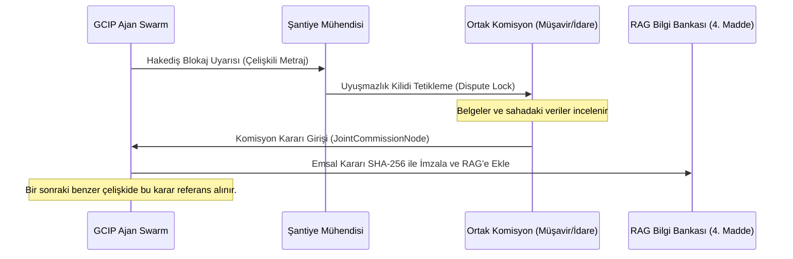

# 22. İnsan Onay Döngüsü (Human-in-the-loop / RLHF)

Bu belge, Global Construction Intelligence Platform'un (GCIP) yapay zeka ajanlarının sahadaki insan mühendislerin düzeltmelerinden otonom olarak öğrenmesini, güven eşiklerini kalibre etmesini ve sistemi zamanla daha zeki hale getiren **RLHF (Reinforcement Learning from Human Feedback - İnsan Geri Bildirimli Takviyeli Öğrenme)** ve **HITL (Human-in-the-loop - Döngüdeki İnsan)** mimarisini tanımlar.

---

## 22.1. Mimari Yaklaşım ve Döngünün Amacı

GCIP, deterministik mühendislik kuralları üzerine kurulmuş olsa da şantiye koşulları, malzeme fire toleransları ve yerel mevzuatlar dinamiktir. Yapay zekanın hata payını sıfıra indirmek ve şantiyenin kültürel alışkanlıklarına adapte olmasını sağlamak için iki yönlü bir geri bildirim döngüsü kurgulanmıştır:

1.  **Doğrulama ve Denetim (HITL):** Kritik kararlar (para transferi, WBS kilitleri) insan mühendis onayı olmadan resmiyet kazanmaz (`8. PRODUCT_PRINCIPLES.md` uyumlu).
2.  **Öğrenme ve Kalibrasyon (RLHF):** İnsan mühendisin yaptığı her manuel düzeltme (Örn: Birim fiyat düzenlemesi, metraj sapması düzeltmesi), yapay zekanın bir sonraki tahminlerini iyileştirmek için birer eğitim verisine dönüştürülür.

```
       Ajan Çıktısı (Örn: %5 Zayiat) ────> Kullanıcı Arayüzü / WhatsApp
                                                    │
                                                    ▼
       Ajan Kararı Öğrenir <─── Geri Bildirim (Manuel Düzeltme: %3 Zayiat)
               │                                    │
               ▼                                    ▼
    Prompt Eşik Kalibrasyonu               Neo4j (:AdjustmentEvent)
  (RLHF Veri Kümesi Güncelleme)           (RFC 3161 Zaman Damgalı)
```

---

## 22.2. Geri Bildirim Türleri ve Veri Toplama

Orkestratör, kullanıcı etkileşimlerinden iki farklı yöntemle geri bildirim toplar:

### 22.2.1. Açık Geri Bildirim (Explicit Feedback)
Kullanıcının sistemin ürettiği veriye doğrudan müdahale etmesidir. 
- **Örnek:** `QS-2` ajanı bir beton metrajını $100 \text{ m}^3$ hesaplamıştır. Şantiye şefi bu miktarı manuel olarak $98 \text{ m}^3$ olarak düzeltir.
- **Sistem Aksiyonu:** Bu düzeltme, Neo4j veritabanında bir `(:AdjustmentEvent)` düğümü oluşturur ve düzeltilen alan, eski değer, yeni değer ve mühendisin yazdığı gerekçe kaydedilir.

### 22.2.2. Örtük Geri Bildirim (Implicit Feedback)
Kullanıcının sisteme doğrudan müdahale etmeden, yapay zeka kararlarını onaylama veya reddetme davranışıdır.
- **Örnek:** Yapay zekanın hazırladığı hakediş icmalinin şantiye şefi tarafından hiçbir değişiklik yapılmadan doğrudan onaylanması (Güven puanı artırıcı etki).
- **Sistem Aksiyonu:** İlgili ajanların parametrik ağırlıkları (weights) ve güvenilirlik katsayıları olumlu yönde güncellenir.

---

## 22.3. Doğrulama ve Güvenlik Filtreleri (Data Integrity Safeguards)

Sahadan gelen her geri bildirimin sisteme kontrolsüzce işlenmesi yapay zekanın manipüle edilmesine veya hatalı öğrenmesine yol açabilir. Bu nedenle geri bildirimler 4 aşamalı güvenlik filtresinden geçer:

### 22.3.1. Yetki Bazlı Ağırlıklandırma (User Authority Weighting)
Her kullanıcının yaptığı düzeltmenin öğrenme katsayısına etkisi, kullanıcının sistemdeki rolüne göre ağırlıklandırılır ($W_{\text{authority}}$):
- **Şirket Ortağı / Proje Müdürü:** $W = 1.0$ (Tam etki, anında kalibrasyon)
- **Şantiye Şefi / Başmühendis:** $W = 0.8$
- **İnce İşler Şefi / Saha Mühendisi:** $W = 0.5$
- **Saha Formeni:** $W = 0.2$ (Düşük etki, sadece istatistiksel veri)

### 22.3.2. Sapma ve Uç Değer Filtresi (Anomaly Detection Guardrail)
Mühendisin girdiği düzeltme değeri, orijinal değerden veya geçmiş ortalamadan **%50'den fazla** sapıyorsa, sistem "hatalı giriş (typo/fat-finger)" şüphesiyle işlemi dondurur. Değer doğrudan kalibrasyon motoruna gönderilmez; ikinci bir mühendis onayına sunulur.

### 22.3.3. Manipülasyon ve Zehirlenme Koruması (Feedback Poisoning Protection)
Yapay zekanın tolerans sınırlarını kötü niyetle yukarı çekmek isteyen kullanıcılara karşı her parametrenin mutlak sınırları (Hard Boundaries) tanımlanmıştır. 
- **Örnek:** Hazır beton zayiat toleransı mutlak üst sınırı $\%8.0$ olarak belirlenmiştir. Mühendis sahada zayiatı $\%12$ olarak onaylasa bile, sistemin otomatik kalibrasyon motorunun öğrenebileceği değer $\%8.0$ sınırını geçemez.

### 22.3.4. Denetim İzi Entegrasyonu (Audit Ledger Linkage)
Her düzeltme eylemi (`AdjustmentEvent`), `14. SECURITY_COMPLIANCE.md` uyumlu olarak, işlemi gerçekleştiren kullanıcının IP adresi ve oturum anahtarıyla birlikte Neo4j üzerindeki bir `(:AuditEntry)` düğümüne kriptografik olarak bağlanır.

---

## 22.4. Sistemin Zamanla Öğrendiği Çekirdek Alanlar (7. Madde Uyum)

Geri bildirim sinyalleri işlendikçe, GCIP otonom olarak şu şantiyesel refleksleri ve parametreleri öğrenir:

1.  **Taşeron Performans Verimliliği:** Taşeron X'in WBS iş programında planladığı hız ile sahada fiilen gerçekleştirdiği ilerleme arasındaki fark (verimlilik çarpanı).
2.  **Meteorolojik Etki Hassasiyeti:** Hangi aktivite türünün (örn: dış cephe boya, kaba yapı beton) yerel hava koşullarından (sıcaklık, rüzgar hızı) ne oranda etkilendiği ve durduğu.
3.  **Poz Bazlı Malzeme Zayiat Oranları:** Şantiyedeki malzeme sınıflarına (nervürlü demir, kablo, hazır beton) ve mekansal bölgelere (`Zone`) göre dinamik değişen fire limitleri.
4.  **Birim Fiyat Sapma Limitleri:** Tedarik zinciri RFQ süreçlerinde piyasa dalgalanmalarına bağlı olarak mühendislerin el ile yaptığı birim fiyat güncellemelerinin esneklik sınırları.

---

## 22.5. RAG Ağırlık Katsayısı ($W_{\text{RAG}}$) Kalibrasyonu (18. Madde Uyum)

Mühendisler yapay zekanın ürettiği bir sözleşme yorumunu veya teknik hak talebini (claim) reddedip bir düzeltme gerekçesi girdiğinde sistem RAG hafızasındaki ağırlıkları günceller:

- **Mekanizma:** Gerekçe metninde *"sözleşmenin özel şartlar maddesi"* veya *"idare ile yapılan mutabakat"* gibi referanslar saptandığında, sistem ilgili sözleşme maddesinin (`ContractClause`) benzer durumlardaki anlamsal eşleşme ağırlık katsayısını ($W_{\text{RAG}}$) yukarı çeker. 
- Bu sayede sonraki aramalarda ilgili madde daha üst sırada getirilir ve üretilen hukuki raporlar yerel şartlara daha uyumlu olur.

---

## 22.6. Düzeltme Verilerinin Neo4j Üzerinde Kaydedilmesi

Her mühendis düzeltmesi, yasal ve teknik izlenebilirlik için `20. DATA_MODEL.md` uyumlu olarak zaman damgalı şekilde Neo4j graf tabanına işlenir:

```cypher
// Mühendis tarafından yapılan bir metraj düzeltmesinin ve denetim izinin kaydedilmesi
MATCH (b:BOQItem {id: $boq_item_id, tenant_id: $tenant_id})
MATCH (u:User {id: $user_id})
CREATE (ae:AdjustmentEvent {
    id: apoc.create.uuid(),
    tenant_id: $tenant_id,
    date: Date($date),
    adjusted_field: 'quantity',
    old_value: ToString($old_quantity),
    new_value: ToString($new_quantity),
    reason: $override_reason,
    user_authority_weight: $user_authority_weight,
    confidence_at_time: $agent_confidence
})
CREATE (u)-[:ADJUSTED {timestamp: DateTime()}]->(ae)
CREATE (ae)-[:TARGETS]->(b)
WITH ae, u
CREATE (audit:AuditEntry {
    id: apoc.create.uuid(),
    tenant_id: $tenant_id,
    timestamp: DateTime(),
    action: 'USER_OVERRIDE_METRIC',
    user_id: u.id,
    description: 'Mühendis poz miktarını el ile güncelledi. EventID: ' + ae.id
})
CREATE (u)-[:GENERATE]->(audit)
RETURN ae.id AS EventID;
```

---

## 22.7. Dinamik Eşik Kalibrasyon Motoru (Python)

```python
from pydantic import BaseModel
from typing import List, Dict
import numpy as np

class AdjustmentRecord(BaseModel):
    old_value: float
    new_value: float
    authority_weight: float
    reason: str

class CalibrationEngine:
    def __init__(self, target_parameter: str, default_value: float, min_boundary: float, max_boundary: float):
        self.target_parameter = target_parameter
        self.default_value = default_value
        self.min_boundary = min_boundary  # Fiziksel alt sınır
        self.max_boundary = max_boundary  # Fiziksel üst sınır (Poisoning Protection)
        self.adjustment_history: List[AdjustmentRecord] = []

    def add_feedback(self, old: float, new: float, weight: float, reason: str):
        # 1. Sapma kontrolü (Anomaly Guardrail): %50'den fazla sapma varsa engelle
        deviation = abs(new - old) / old if old > 0 else 0.0
        if deviation > 0.50:
            print(f"⚠️ Kritik Sapma Tespiti: Parametre kalibrasyona dahil edilmedi. Sapma: %{deviation*100:.1f}")
            return
            
        # 2. Mutlak Sınır Kontrolü (Feedback Poisoning Protection)
        bounded_new = max(self.min_boundary, min(new, self.max_boundary))
        if bounded_new != new:
            print(f"🛡️ Zehirlenme Koruması: Girdi {new} değeri mutlak sınır olan {bounded_new} ile sınırlandırıldı.")
            
        self.adjustment_history.append(
            AdjustmentRecord(old_value=old, new_value=bounded_new, authority_weight=weight, reason=reason)
        )

    def calculate_new_threshold(self, threshold_window: int = 5) -> float:
        """Ağırlıklı son N düzeltmeye bakarak yeni parametre eşiğini hesaplar."""
        if len(self.adjustment_history) < threshold_window:
            return self.default_value
            
        recent = self.adjustment_history[-threshold_window:]
        
        # Ağırlıklı ortalama hesabı (User Authority Weighting)
        values = np.array([rec.new_value for rec in recent])
        weights = np.array([rec.authority_weight for rec in recent])
        
        if sum(weights) == 0:
            return self.default_value
            
        calibrated_value = float(np.average(values, weights=weights))
        return calibrated_value

    def rollback_to_default(self):
        """Hatalı kalibrasyon durumunda parametreyi fabrika ayarlarına geri döndürür."""
        self.adjustment_history.clear()
        return self.default_value
```

---

## 22.8. RLHF İnce Ayar (Fine-Tuning) Veri Seti Üretim Hattı

Kullanıcılardan toplanan düzeltmeler, sadece parametreleri kalibre etmekle kalmaz; alt modelleri şantiye diline ve teknik alışkanlıklara göre eğitmek için talimat veri kümelerine dönüştürülür.

### JSONL Formatında Eğitim Verisi Oluşturma Mantığı
Her `AdjustmentEvent` sonrasında oluşan hatalı yapay zeka çıktısı ve insan düzeltmesi aşağıdaki JSONL şemasında bir eğitim satırına dönüştürülür:

```json
{
  "messages": [
    {"role": "system", "content": "Sen GCIP platformunun sözleşme analiz ajanısın. Metinlerdeki gecikme sürelerini ve idari hak düşürücü süreleri (FIDIC 20.1) hesaplamakla yükümlüsün."},
    {"role": "user", "content": "İdareden 20.06.2026 tarihinde gelen yer teslim gecikmesi yazısını incele. Hak düşürücü süre sonunu hesapla."},
    {"role": "assistant", "content": "İnceleme tamamlandı. Yer teslim yazısı 20.06.2026 tarihlidir. FIDIC 20.1 uyarınca 28 günlük bildirim süresi 18.07.2026 tarihinde dolmaktadır."},
    {"role": "human_override", "content": "Yanlış hesaplama. Sözleşmenin Özel Şartlar 4.2 maddesine göre bildirim süresi 28 gün değil, kamu ihale kanunu gereği 15 gündür. Doğru tarih 05.07.2026 olmalıdır."},
    {"role": "aligned_output", "content": "Özel Şartlar 4.2 maddesi önceliklendirilmiştir. 15 günlük kamu ihale mevzuatı uyarınca hak düşürücü son bildirim tarihi 05.07.2026'dır."}
  ]
}
```

---

## 22.9. Kalibrasyon Çalışma Pencereleri (Execution Windows)

Öğrenilen parametrelerin sisteme yansıtılması iki farklı zaman diliminde yönetilir:
- **Gerçek Zamanlı (Real-Time):** Birim fiyat güncellemeleri, sözleşme zeyilnameleri ve İSG ceza tutarları gibi finansal ve idari değişiklikler anında veritabanına ve promptlara yansır.
- **Haftalık Analiz (Weekly Batch):** Zayiat tolerans limitleri, zaman gecikme float sınırları ve güven skoru katsayıları gibi istatistiksel veriler pazar geceleri otomatik analiz edilerek haftalık sürüm (`baseline_version`) olarak güncellenir.

---

## 22.10. Güven Skoru ($C_{\text{score}}$) Dinamik Güncellemesi

Orkestratörün kararlarının güvenirliği, kullanıcının geçmiş onay oranlarına göre Bayesyen bir yaklaşımla gerçek zamanlı güncellenir.

### Bayesyen Güven Güncelleme Formülü
Yapay zekanın bir karardaki yeni güven skoru ($P(A|B)$), kullanıcının geçmişteki onaylama sıklığına göre şu şekilde güncellenir:

$$C_{\text{new}} = \frac{C_{\text{old}} \cdot P(\text{Onay}|\text{AI\_Doğru})}{C_{\text{old}} \cdot P(\text{Onay}|\text{AI\_Doğru}) + (1 - C_{\text{old}}) \cdot P(\text{Onay}|\text{AI\_Hatalı})}$$

Bu formül sayesinde:
- Mühendisin sık sık onayladığı ajanların güven skorları yükselir ve insan onay ekranına düşmeden otonom geçiş (bypass) hakkı kazanır.
- Mühendisin sık sık düzelttiği/reddettiği ajanların güven skorları hızla düşürülür ve her kararında insan onay kapısı (`SPE-9`) zorunlu tutulur.

---

## 22.11. Ortak Komisyon (Joint Commission) Karar Loglama Akışı

Bir düzeltme veya uyuşmazlık tek taraflı çözülemediğinde, `18. DECISION_FRAMEWORK.md` uyarınca ortak komisyon kurulur. Komisyonun verdiği nihai karar veri tabanına işlenerek gelecekteki benzer uyuşmazlıklar için "emsal karar" (knowledge base chunk) olarak RAG sistemine beslenir.



---

## 22.12. Üretim Sınıfı Şemalar ve API Arayüzü

### Geri Bildirim Alma API Girdi Şeması (JSON)

```json
{
  "tenant_id": "TR-ANK-009",
  "session_id": "9b1deb4d-3b7d-4bad-9bdd-2b0d7b3d4bad",
  "user_metadata": {
    "user_id": "usr_eng_ahmet_kaya",
    "role": "PROJECT_MANAGER",
    "authority_weight": 1.0
  },
  "feedback_data": {
    "target_node_id": "boq_poz_demır_014",
    "target_field": "unit_price",
    "action": "OVERRIDE",
    "original_value": "450.00",
    "submitted_value": "485.00",
    "justification": "Demir fiyatlarına gelen Yİ-ÜFE eskalasyon farkı el ile yansıtıldı."
  },
  "system_state": {
    "active_agent": "BIL-4",
    "agent_confidence_score": 0.81
  }
}
```

### Prompt Kalibrasyonu Arayüz Şeması (JSON)

```json
{
  "tenant_id": "TR-ANK-009",
  "calibration_event": {
    "parameter_name": "iron_waste_factor",
    "previous_value": 0.02,
    "calibrated_value": 0.04,
    "confidence_factor": 0.95,
    "trigger_source": "5_consecutive_user_overrides",
    "effective_date": "2026-06-27T12:00:00Z"
  }
}
```
